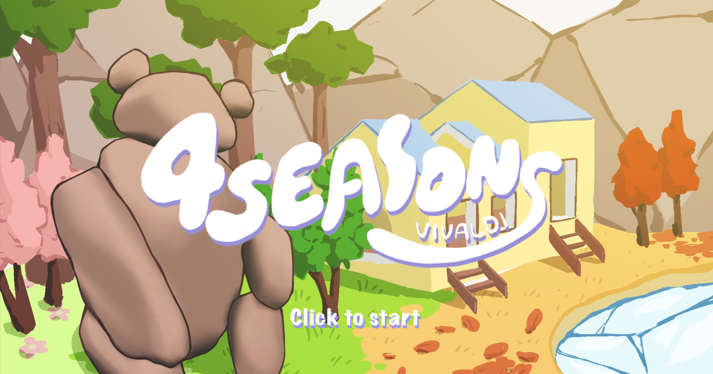

# Four Seasons - CSE 125 Team 5 (Vivaldi)

Four Seasons is a character-based 2v2 capture-the-flag shooter.

<!--  -->

<!--  -->




<!--  -->


## Playtest Video Record
[https://drive.google.com/file/d/1qgqhsNL39TvHxn07MIBAesWoLx-CLxX5/view?usp=drive_link](https://drive.google.com/file/d/1qgqhsNL39TvHxn07MIBAesWoLx-CLxX5/view?usp=drive_link)


## Game Rules

There are four characters associated with each of the four seasons, each with a unique ability.
Two teams of two players fight to capture the egg for as long as they can.

Players may shoot each other and use abilities to try to take control of the egg.
When a player's HP is depleted, their position on the map is swapped with their shooter's (players don't die in this game!).
If a player is "killed" while holding the egg, the player and their shooter swap positions, and the egg is given to the killer.

Each character can launch a projectile, each with its own unique side-effects!

| Character        | Projectile Effect                                 |
|------------------|---------------------------------------------------|
| Bunny (Spring)   | Heals all players within its radius upon impact   |
| Bear (Summer)    | "Confuse" all players within its radius on impact  |
| Fox (Fall)       | Launch a projectile that deals significant knockback |
| Penguin (Winter) | Significantly reduce all player movements caught in its radius |

The active season also has a passive effect on gameplay

| Season          | Seasonal Effect                 |
|-----------------|---------------------------------|
| Spring   | Passive Healing for all players |
| Summer | Triple jump                     |
| Fall    | Reduced ability cooldowns       |
| Winter  | Faster movement on the ground   |

Points are awarded according to how long each team maintains control of the egg, though the egg may not always be safe to hold :).

The team with the most points when the timer runs out is crowned the winner! (~~Assuming the bug got fixed~~)

## Controls
`W`: Move forward

`A`: Move left

`S`: Move backwards

`D`: Move right

`SPACE`: Jump

`E`: Throw the egg (if currently holding the egg)

`Left-Click`: Shoot

`Right-Click`: Use ability

## Development Setup

Our code is cross-platform! ~~Unless you're on Linux~~ We support developing and building Vivaldi on both Windows and macOS, and the build instructions will be (or at least, should be) identical on both platforms.

### Setting up your environment
1. [Download](https://visualstudio.microsoft.com/) Visual Studio (NOT Visual Studio Code!) from Microsoft's website. Make sure you specify to download CMake in the installation options.
   1. If you forgot to select to install CMake while setting up Visual Studio, you can still select the option by opening up Visual Studio Installer on your machine.
2. If you don't want to install CMake from Microsoft, you can also download it from [here](https://cmake.org/) on CMake's official website.
3. Download whatever IDE/text editor you'd like, Visual Studio, Visual Studio Code, CLion, ~~Microsoft Word~~, Vim, it doesn't matter.
4. Clone the repository onto your machine, warning: the repo is quite fat as we included the source code for several libaries in order to make cross-platform development as smooth as possible.
```
git clone https://github.com/ucsd-cse125-sp24/group5.git
```
5. If you want IDE integration with the code, make sure to load the CMake project associated with the `CMakeLists.txt` in the repository's root directory.


### Building Four Seasons from the command line

From the repository root, run the following to build the game in debug mode.
```sh
$ mkdir build
$ cd build
$ cmake ..
$ cmake --build .
```
Alternatively you can use an IDE of your choice such as Visual Studio, or CLion to manage building for you since this is just a
CMake project. We recommend building the project in `release` mode if possible.

### Running Four Seasons

Four Seasons can be run on both MacOS and Windows systems. Though all machines (including the server) all either be on Windows or MacOS due to some god forsaken reason we didn't have time to figure out.

#### Running Four Seasons on MacOS with Visual Studio Code
1. First, modify each client machine's `common/setup.json`'s `server-ip` and `server-port` (Modifying `server-port` is optional) option to the IP address/port of whatever server you want to run on.
   1. The server will run on the port specified by `common/setup.json`
2. Start the server by changing to the `server/` directory and running `../build/server/src/server` from the command line.
3. After the server has started, start each client by changing to the `client/` directory and running `../build/client/src/client` from the command line.

#### Running Four Seasons on Windows (todo)
1. First, modify each client machine's `common\setup.json`'s `server-ip` and `server-port` (Modifying `server-port` is optional) option to the IP address/port of whatever server you want to run on.
   1. The server will run on the port specified by `common\setup.json`
2. Start the server either by pressing the green arrow of happiness on your IDE of choice or by changing to the `todo` directory and running `todo` from the command line.
3. After the server has started, start each client either by the green arrow of happiness on your IDE or by changing to the `todo` directory and running `todo` from the command line.


### Developing Four Seasons
If you want to add any additional libraries, make sure to copy the library's source code to `lib` and add modify `./CMakeLists.txt` accordingly with `add_subdirectory` to the
directory containing the library's source code within `./lib`. Also be sure to modify `client/src`'s and `server/src`'s `CMakeLists.txt` accordingly.

**There are much better ways of doing this like with FetchContent, but we're dumb.**

The only library that was not added following the process above is `Freetype` for client text-rendering. ~~Don't be like Alan >:(~~

`./common` contains definitions pertaining to server and client programs.

Add any additional server/client-specifc header files to `client/include` or `server/include`. CMake should automatically detect new header files so creating the file should be the only step.
